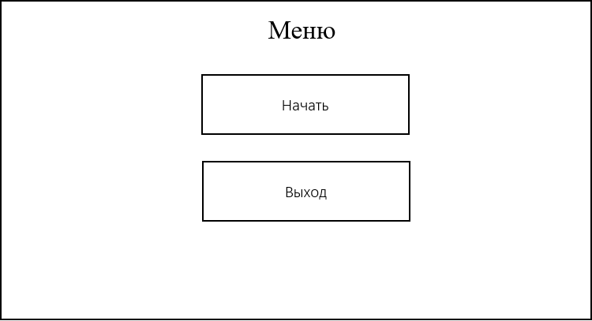
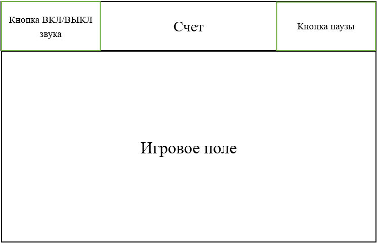

# Требования к проекту
---

# Содержание
1. [Введение](#intro)  
1.1 [Назначение](#appointment)  
1.2 [Бизнес-требования](#business_requirements)  
1.2.1 [Исходные данные](#initial_data)  
1.2.2 [Возможности бизнеса](#business_opportunities)  
1.3 [Аналоги](#analogues)  
1.3.1 [Project Pongs](#pr_pong)
1.3.2 [Laser Paddles](#Laser_Pong)
1.4 [Правила игры](#Rools)
2. [Требования пользователя](#user_requirements)  
2.1 [Программные интерфейсы](#software_interfaces)  
2.2 [Интерфейс пользователя](#user_interface)  
2.2.1 [Интерфейс игрового поля](#user_interface_game)
2.2.2 [Интерфейс меню](#user_interface_menu)
2.3 [Характеристики пользователей](#user_specifications)  
2.3.1 [Аудитория приложения](#application_audience)  
2.3.1.1 [Целевая аудитория](#target_audience)  
2.3.1.1 [Побочная аудитория](#collateral_audience)  
2.4 [Предположения и зависимости](#assumptions_and_dependencies)  
3. [Системные требования](#system_requirements)  
3.1 [Функциональные требования](#functional_requirements)  
3.2 [Нефункциональные требования](#non-functional_requirements)  

<a name="intro"/>

# 1 Введение

<a name="appointment"/>

## 1.1 Назначение
Десктопная игра "Пин-понк" предназначена для увлекательного время припровождения.
Приложение создано для пользователей ОС Windows 10.

<a name="business_requirements"/>

## 1.2 Бизнес-требования

<a name="initial_data"/>

### 1.2.1 Исходные данные
В наше время игровая индустрия является большой частью IT-рынка. И все больше и больше людей интересуется не крупными проектами, за которыми можно провести не один вечер в компании себя и увлекательной истории, а мелкими инди-проектами, за которыми можно убить несколько минут времени во время очереди, на скучной лекции или на обеденном перерыве на работе.

<a name="business_opportunities"/>

### 1.2.2 Возможности бизнеса
Данное приложение будет пользоваться популярностью самых разных групп пользователей - от детей, которые хотят посоревноваться на перерыве в "Пин-Понк", до взрослых.

<a name = "analogues"/>

## 1.3 Аналоги

<a name = "pr_pong"/>

### 1.3.1 ProjectPong

**Русский интерфейс:** нет  
**Цена:** ~1-3$  
**Ссылка на страницу магазина:** https://store.steampowered.com/app/1377930/ProjectPong/

ProjectPong - неклассический представитель данного жанра, является более усложненной версией классического Pong'a.

<a name = "Laser_Pong"/>

### 1.3.2 Laser Paddles

**Русский интерфейс:** нет  
**Цена:** ~2$  
**Ссылка на страницу магазина:** https://store.steampowered.com/app/1079050/Laser_Paddles/

Laser Paddles - еще один неклассический представитель данного жанра, является более усложненной версией классического Pong'a с элементами разрушения.

<a name = "Rools"/>

## 1.4 Правила игры
После того как пользователь начал новую игру, игра начинает обратный отсчет. Каждая игра длится 5 минут, после этого победителем становится тот, кто забил больше голов сопернику, если оба игрока забили одинаковое количество голов, то игра заканчивается ничьей. В таком случае рекомендуется начать новую игру и решить, кто лучший игрок в Pong.

# 2 Требования пользователя

<a name="software_interfaces"/>

## 2.1 Программные интерфейсы
Разработка будет вестись с использованием языка программировани C# и игрового движка UNITY. 

<a name="user_interface"/>

## 2.2 Интерфейс пользователя
Создаваемый программный продукт будет иметь классический графический пользовательский интерфейс.

<a name="user_interface_menu"/>

### 2.2.1 Интерфейс главного меню
Интерфейс пользователя будет содержать главное меню, из которого пользователь сможет либо выйти из игры, либо начать новый матч. 

<a name="user_interface_game"/>

### 2.2.2 Интерфейс игрового поля
Если пользователь начал новую игру, то на экране, помимо игрового поля, в верхней части экрана будут располагаться графа счета, кнопка меню и паузы и т.д.

<a name="user_specifications"/>

## 2.3 Характеристики пользователей
Программный продукт нацелен на рядового пользователя, обладающего компьютерными навыками и имеющим/не имеющим опыт в компьютерных играх.

<a name="user_classes"/>

### 2.3.1 Аудитория приложения

<a name="target_audience"/>

#### 2.3.1.1 Целевая аудитория
Люди, желающие провести немного времени за увлекательной игрой в Pong.

<a name="collateral_audience"/>

#### 2.3.1.2 Побочная аудитория
Люди, предпочитающие решать конфликт не в рукопашном бою, а за партией в Pong.

<a name="assumptions_and_dependencies"/>

## 2.4 Предположения и зависимости
1. Программный продукт предпологает наличие клавиатуры, мышки и динамика.

<a name="system_requirements"/>

# 3 Системные требования
Создаваемый программный продукт создается для работы в операционной системе Windows.

<a name="functional_requirements"/>

## 3.1 Функциональные требования
1. Понятный пользовательский интерфейс
2. Красивые и плавные текстуры и анимация
3. Оригинальность и хорошие игровые свойства

<a name="non-functional_requirements"/>

## 3.2 Нефункциональные требования
Для создаваемого продукта необходима невысокая требовательность к ресурсам компьютера.

